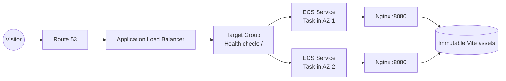
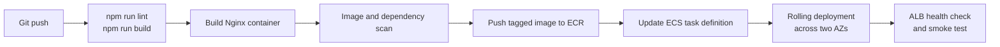

# AWS High-Availability Web Platform

<p align="center">
  <strong>A resilient static frontend, designed to stay available.</strong><br />
  React + TypeScript + Vite, packaged for an AWS ECS deployment.
</p>

<p align="center">
  <a href="#architecture">Architecture</a> ·
  <a href="#pipeline">Pipeline</a> ·
  <a href="#local-development">Local development</a> ·
  <a href="#container-contract">Deployment</a>
</p>

<p align="center">
  
  
  
  
</p>


## The idea

This project is a production-minded static portfolio frontend for **Ahmed Wael**, a DevOps Engineer focused on AWS cloud infrastructure, Terraform, Docker, Kubernetes, Linux, and CI/CD.

The page treats availability as a visual and technical principle: a clear interface, a small immutable asset surface, container-ready delivery, and a deployment topology that can route around an unhealthy task.

> Build it. Break it. Observe it. Recover it.

## What is inside

| Area | Implementation |
| --- | --- |
| UI | React 19 with TypeScript |
| Build | Vite 8 production bundle |
| Styling | Tailwind CSS v4 plus a custom bento visual system |
| Motion | Framer Motion entrance reveals and GSAP orbital animation |
| Icons | Lucide React |
| Web server | Nginx on port `8080` |
| Frontend behavior | SPA fallback, responsive bento layout, accessible links and image alt text |
| Deployment target | AWS ECS on Fargate behind an Application Load Balancer |

## Architecture

The intended AWS topology keeps the frontend stateless. Every ECS task serves the same immutable Vite build, while the load balancer health check removes unhealthy tasks from rotation.



### Availability characteristics

- **Multi-AZ tasks:** run at least one healthy task in each of two Availability Zones.
- **Health-based routing:** the ALB sends traffic only to passing targets.
- **Automatic replacement:** ECS maintains the desired task count when a task fails.
- **Stateless delivery:** no local session or uploaded file is required by the frontend.
- **Cache-friendly assets:** Vite hashes assets and Nginx marks `/assets/` responses as immutable for one year.
- **Graceful SPA navigation:** Nginx falls back to `index.html` for client-side routes.

## Pipeline

The delivery path is intentionally simple: validate first, build once, publish an immutable image, then roll the ECS service forward.



### Suggested CI/CD stages

1. Install dependencies with `npm ci`.
2. Run `npm run lint`.
3. Run `npm run build`.
4. Build and scan the Nginx container image.
5. Push the commit-tagged image to Amazon ECR.
6. Register a new ECS task definition revision.
7. Deploy with an ECS rolling update and wait for healthy targets.
8. Run a smoke test against the ALB endpoint.

The repository currently contains the application, build scripts, and Nginx runtime configuration. Docker, Terraform, ECR, ECS, and CI workflow files are the next infrastructure layer to add.

## Local development

### Requirements

- Node.js 20 or newer
- npm 10 or newer

### Start the app

```bash
npm install
npm run dev
```

Vite will print the local URL, usually `http://localhost:5173`.

### Validate a production build

```bash
npm run lint
npm run build
npm run preview
```

## Container contract

The included [nginx.conf](nginx.conf) defines the runtime behavior expected inside the future image:

```text
Build output       dist/
Web server         Nginx
Container port     8080
SPA fallback       /index.html
Asset cache        /assets/ -> immutable, 1 year
Compression        gzip enabled
Security headers   X-Frame-Options, X-Content-Type-Options, Referrer-Policy
```

A minimal production Dockerfile can use a multi-stage build:

```dockerfile
FROM node:20-alpine AS build
WORKDIR /app
COPY package*.json ./
RUN npm ci
COPY . .
RUN npm run build

FROM nginx:alpine
COPY nginx.conf /etc/nginx/conf.d/default.conf
COPY --from=build /app/dist /usr/share/nginx/html
EXPOSE 8080
CMD ["nginx", "-g", "daemon off;"]
```

## Project map

```text
src/
  App.tsx       Portfolio content, interactions, and motion
  App.css       Bento layout and visual tokens
  index.css     Global reset and Tailwind entry point
  main.tsx      React application entry point
public/
  profile.png   Profile image used in the identity card
nginx.conf      ECS container web-server contract
```

## Design notes

The interface uses a dark operations-room palette with high-contrast lime signals. Bento panels keep the resume scannable, while the featured architecture diagram gives the visitor a concrete reason to trust the infrastructure story.

The visual system is intentionally restrained around data and action:

- Lime means active, healthy, or actionable.
- Warm orange marks the featured system and important emphasis.
- Monospace labels identify infrastructure vocabulary and states.
- Motion is reserved for arrival and the orbiting system signal.

## Author

**Ahmed Wael (abomorad)**<br />
DevOps Engineer · AWS Cloud Infrastructure · Docker · Kubernetes · Terraform · Linux · CI/CD<br />
Cairo, Egypt

- LinkedIn: [linkedin.com/in/ahmedmediaworkx](https://www.linkedin.com/in/ahmedmediaworkx)
- Email: [ahmedmediaworkx.freelance@gmail.com](mailto:ahmedmediaworkx.freelance@gmail.com)

---

<p align="center"><em>When one part cannot, the system keeps moving.</em></p>
